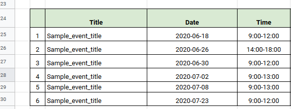

# googleSheetsToCalendar
Python script to import events written in Google Sheets to your Google Calendar. The script is based on this google sheet format:

In order to install requirements you can simply run "pip install -r requirements.txt".
